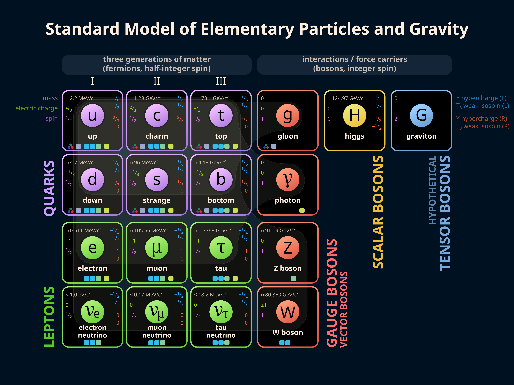

# Dendritic NixOS Flake


## Installation
1. Build the installer image
```bash
nix build .#flake.nixosConfigurations.installer.config.system.build.image
```

2. Flash it to an USB-Drive
```bash
dd if=result/iso/lepton-installer.iso of=/dev/sdX bs=4M status=progress && sync
```

3. Run the installer on the end machine
```bash
just install-lepton
```